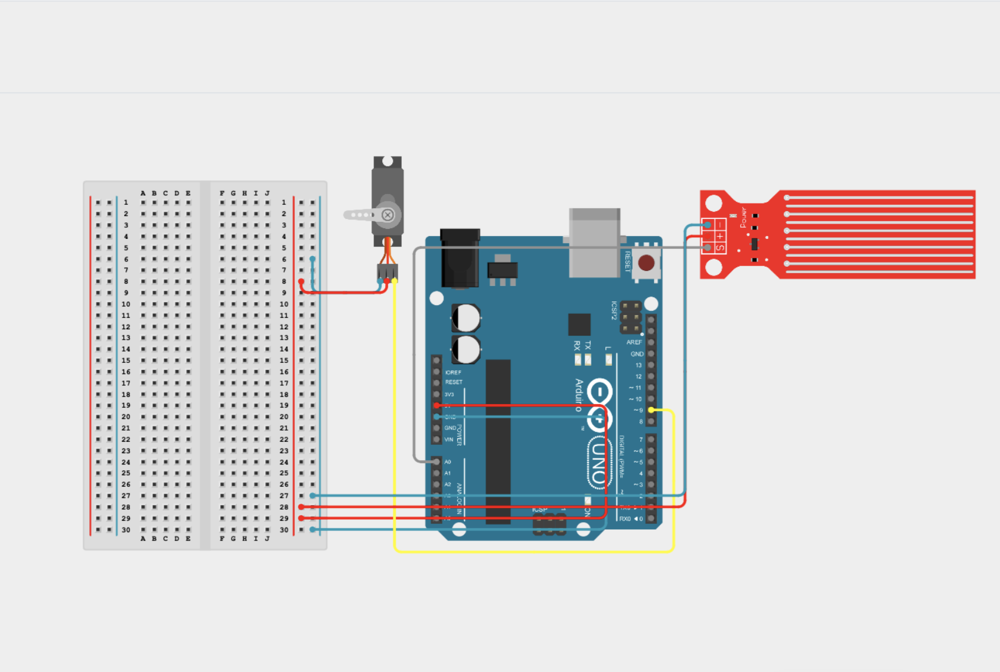

# water-detection-servo-control
An Arduino-based system that detects water and automatically activates a servo motor. It can be used for simple automatic systems such as closing a window or moving a cover.
## Objective
The goal of this project is to create a simple automatic system that reacts to water detection by moving a servo motor.
## Components


_arduino uno

_water sensor module

_Servo Motor

_Breadboard

_Jumper wires

## plan 

1. connecting:

Arduino 5V  ─→ + Power Rail ─→ Sensor VCC
                                      └─→ Servo Red

Arduino GND ─→ - Power Rail ─→ Sensor GND
                                      └─→ Servo Brown

Arduino A0 ──→ Sensor Signal
Arduino D9 ──→ Servo Yellow

2. Upload the Arduino code.

3. When water is detected, the Arduino activates the servo.

4. Test the system and adjust the servo position if needed.

## how it works

The water sensor detects the presence of water and sends a signal to the Arduino.
The Arduino processes the signal and activates the servo motor when water is detected.

Water Sensor → Arduino → Servo Motor

## Real circuit


## Simulation


## Arduino Code
```cpp
#include <Servo.h>

Servo myServo;

const int waterSensor = A0;
const int servoPin = 9;
const int threshold = 400;

void setup() {
  Serial.begin(9600);

  myServo.attach(servoPin);
  myServo.write(0);
}

void loop() {
  int waterValue = analogRead(waterSensor);

  Serial.println(waterValue);

  if (waterValue > threshold) {
    myServo.write(90);
  } else {
    myServo.write(0);
  }

  delay(100);
}
